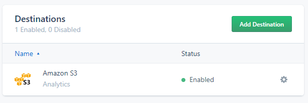
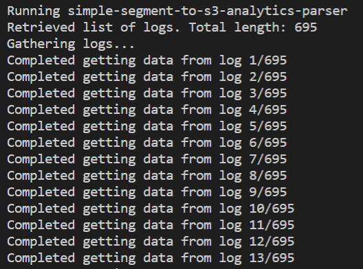
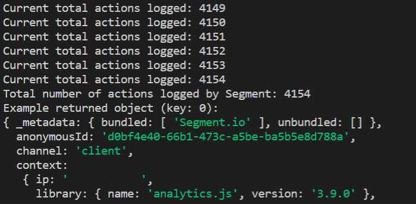

# simple-segment-to-s3-analytics-parser
Turn compressed Segment analytic logs into JS objects.

### Installation
Clone this repo to your machine and run `npm install`

`https://github.com/radihuq/simple-segment-to-s3-analytics-parser`

### Dependencies
This parser uses the [AWS SDK npm package](https://www.npmjs.com/package/aws-sdk).

### Usage
1. Make sure at least one of your Segment source's destination is an AWS S3 bucket
 
2. Edit the `BUCKET`, `REGION`, `ACCESS`, and `SECRET_KEY` variables to include your AWS credentials
3. Run `npm run parser`

### Screenshots
*Parser starting (note: some logs contain more than one action)*

*Parser turning Segment logged actions into JS objects*

### Author
This parser was created by Radiun Huq. You can reach him at:

`Email: radi@mrhuq.com`

`Twitter: @radiunhuq`